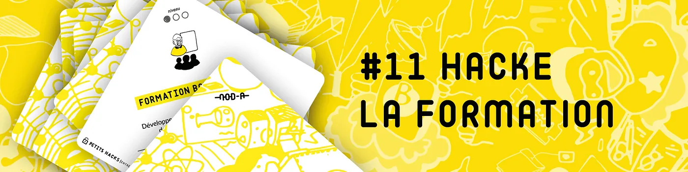
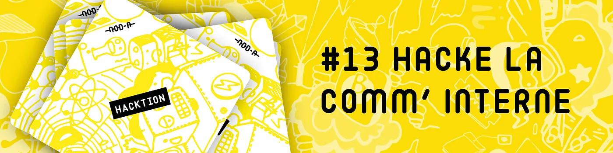

```{r setup, include=FALSE}
library(tidyr, quietly = TRUE)
library (xaringanExtra, quietly=TRUE)
```

class: clear

## Informations sur cette UE


### Cinq séances

--

### Une pause toutes les heures (environ)

--

### Note sur 20

* travail en groupe noté sur 5 lors de la séance n° 3 (24 octobre)
* contrôle noté sur 15 lors de la séance n° 5 (19 décembre)

--

### Un cours de dernière année qui projette dans le milieu professionnel

???

Je me présente.

Qui est en alternance ?

21 diapos en 30'

---

class: inverse, mline, center, middle

# Pourquoi la rétention d’information ?

---
class: clear

## L’information

Est une :
* source de pouvoir
* source de richesse
* source de capital social

Elle :
* procure un avantage compétitif
* rend indispensable (protège contre le licenciement)

---
class: clear

```{r xaringanExtra-scribble, echo=FALSE}
xaringanExtra::use_scribble()
```

## L’information

.right-column[Accumulation]

<br />
<br />
<br />
<br />
<br />
<br />
<br />
<br />
<br />
<br />
<br />
<br />
.pull-left[Rétention] .pull-right[Partage]

???

Dessiner le triangle (touche "s").

---
class: clear

## La rétention d’information

Celui ou celle qui pense avoir plus à perdre à partager l’information qu’à gagner va faire de la rétention d’information.

<br />
<br />

--

Une inclinaison naturelle ?

<br />
<br />

--

En tous cas une inclinaison néfaste pour les organisations.

---
class: clear

## La rétention d’information

> L'ego humain, le désir de dominer directement ou indirectement les autres avec ses connaissances, les incitations financières, la culture de travail compétitive, le mécontentement ou la frustration envers l'entreprise et les structures organisationnelles bureaucratiques à l'ancienne, entravent la libre circulation des connaissances et constituent autant d'obstacles à la gestion des connaissances.

.right.font80[Bilginoğlu, E. (2019). « Knowledge hoarding: A literature review ». *Management Science Letters*, 9(1), 61-72]

???

> The human ego, the desire to directly or indirectly dominate others on the basis of knowledge, financial incentives, the competitive work culture, discontent or frustration with the company and the old fashioned bureaucratic organizational structures hinder the free flow of knowledge and constitute several thrusts against knowledge management.

---
class: clear 

## Culture d’entreprise

Plus une organisation donne de la valeur à l’information, plus les employés seront enclins à la négocier chèrement.

Celui à qui on donne une information pourrait même l'utiliser contre vous !

--

.center.inverse.font120[Paradoxe] 

???


L'expertise ne doit pas être plus valorisée que le fait de mentorer, de venir en aide…

---
class: inverse, mline, center, middle

# Pourquoi partager l’information ?

---
class: clear

```{r xaringan-editable, echo=FALSE}
xaringanExtra::use_editable(expires = 1)
```

## Quels arguments utiliser pour inciter à partager l’information ?

<br />
<br />
.center.font150[À vous de jouer !]

<br />

* .can-edit[      ]
* .can-edit[      ]
* .can-edit[      ]
* .can-edit[      ]
* .can-edit[      ]
* .can-edit[      ]
* .can-edit[      ]
* .can-edit[      ]
* .can-edit[      ]

???

Editer la liste à puces. Par ex. :
- augmentez votre statut dans l'entreprise 
- montrez tout ce que vous savez, que vous êtes expert
- l'information partagée aujourd'hui est un problème en moins demain
- ne soyez pas le maillon faible, la cause de la défaite 
- sans cette information nous allons réinventer la roue
- le savoir d'aujourd'hui sera obsolète demain
- tout le monde le fait, surtout les dirigeants
- si "la connaissance est un pouvoir" (Francis Bacon), le partage de la connaissance doit être encore plus puissant
- toutes les religions prêchent le partage du savoir (cf. [Naachimuthu, K.P. (2007), “We are from knowledge sharing culture”, *Journal of Management and
Labour Studies*, Vol. 32 No. 3](https://ideas.repec.org/a/sae/manlab/v32y2007i3p369-374.html))

---
class: clear

## Le point de vue du management

<br />

> Le management doit créer une culture du partage des connaissances, où le partage des connaissances est la norme et non l'exception, où les gens sont encouragés à travailler ensemble, à collaborer et à partager, et où ils sont récompensés pour cela.

--
<br />
<br />

Sans oublier :
- la structure de l'organisation
- le management de l'organisation
- l'infrastructure numérique de l'organisation

.footnote[Bilginoğlu, E. (2019). « Knowledge hoarding: A literature review ». *Management Science Letters*, 9(1), 61-72]

???

> The management should create a knowledge sharing culture, where knowledge sharing is the norm, not the exception, where people are encouraged to work together, to collaborate and share, and where they are rewarded for doing so.

---
class: inverse, mline, center, middle

# Comment partager l’information ?

---
class: clear

## S'autoriser des raccourcis ("hacks")

<br />

[](https://medium.com/corporate-hacking/hack-du-jour-11-hacke-la-formation-11672389e149)

[](https://medium.com/corporate-hacking/hack-du-jour-13-hacke-la-comm-interne-b5e41f4885eb)

???

Hacke la formation : ne pas attendre le plan de formation, regarder "qui fait quoi" (plutôt que qui est quoi) pour aller chercher la connaissance là où elle est : apprendre à utiliser ChatGPT, à faire une macro Excel… Pas besoin d'un séminaire d'une journée !

Hacke la comm' interne : rendre public les calendriers de l'équipe pour avoir plus d'empathie pour leur travail, mieux cerner les spécialités et compétences des autres, avoir la vue d'ensemble et donner du sens à son travail

---
class: clear

## Changer de paradigme

> **Vous devez (...) vous assurer que [vos collaborateurs] aient accès à tout ce dont ils ont besoin. Nombre d'entreprises fonctionnent sur le principe inverse : accès aux infos et aux applications uniquement [si nécessaire].** Totalement stérile. À moins de travailler dans l'armée ou l'une des très rares entreprises gérant des infos ultra-confidentielles – auxquelles même des salariés de confiance n'ont pas accès –, limiter l'accès à l'information ne fait que compliquer les tâches de chacun.

> Une partie du problème réside dans la fierté de certains chefs à se sentir M. ou Mme Barrage. Devoir être sollicité – disons même *courtisé* – leur procure une satisfaction perverse. Ce syndrome peut être, hélas, surpuissant.

> Certains, il est vrai, mettent un point d'honneur à ce que tout passe par eux, même si cela n'est pas nécessaire. Alors qu'il vaudrait mieux remplacer la ronde des autorisations et des contrôles par un véritable travail de création de valeur ajoutée pour l'entreprise et ses clients. 

.footnote[J. Fried, D. H. Hansson & V. Palfrey (2021), *Remote : le guide indispensable du télétravail*, Alisio.]

???

---
class: clear

## Adopter des outils favorisant le partage 1/2

<br />
> Nous disposons aujourd'hui d'une kyrielle d'outils pour que tout soit à disposition. Certains s'en sortent très bien avec seulement le partage de fichiers Dropbox. D'autres ont Highrise ou Salesforce pour suivre les courbes de ventes. L'objectif est d'éviter que des documents importants soient confinés dans un seul ordinateur ou une seule messagerie. **Mettez l'essentiel à disposition, et personne n'aura à partir à la chasse aux infos pour savoir ce qu'il doit faire.**

.footnote[J. Fried, D. H. Hansson & V. Palfrey (2021), *Remote : le guide indispensable du télétravail*, Alisio.]

???

Basecamp, une culture d'entreprise entièrement à distance

---
class: clear

## Adopter des outils favorisant le partage 2/2

<br />
.center.font150[À quoi ressemblerait l'outil idéal ?]

.pull-left[
Besoin / problème :
* .can-edit[      ]
* .can-edit[      ]
* .can-edit[      ]
* .can-edit[      ]
* .can-edit[      ]
* .can-edit[      ]
* .can-edit[      ]
* .can-edit[      ]
* .can-edit[      ]
* .can-edit[      ]

]


.pull-right[
Fonctionnalité :
* .can-edit[      ]
* .can-edit[      ]
* .can-edit[      ]
* .can-edit[      ]
* .can-edit[      ]
* .can-edit[      ]
* .can-edit[      ]
* .can-edit[      ]
* .can-edit[      ]
* .can-edit[      ]
]


???

Faire un premier exemple ensemble puis les faire réfléchir par binôme pendant 20', et mettre en commun.

1. L'info n'est pas disponible. / Par défaut les informations sont accessibles.
2. On est noyé sous les notifications (déluge informationnel). / Les notifications sont optionnelles.
3. On ne sait pas ce que font les autres. / On peut voir l'activité de chacun.
4. Déléguer des tâches. / On peut affecter des tâches.
5. L'info transitoire ne doit pas être mélangée avec l'info permanente. / On peut choisir de poster un message ou un chat.
6. Les vieilles infos sont perdues. / Le moteur de recherche est top.
7. Réagir par émoji à un message. / Comme dans Whatsapp.

---
class: clear

## Nécessaire adaptation à ces outils et leurs bénéfices

Lire *Numérique collaboratif et organisation du travail. Au-delà des promesses* / https://s.42l.fr/la-fabrique (pp. 41-47) et discuter

???

1h sont écoulées, faire une pause de 15', distribuer le document et le faire lire à leur retour.

Laisser 30' de lecture. Questions : quelle est la nature de ce texte ? Qui sont les autrices ?

URL : https://www.la-fabrique.fr/wp-content/uploads/2023/08/n46_numerique-collaboratif-et-organisation-du-travail_web.pdf 

---
class: clear

### Communication interne mieux ciblée et priorisation des messages

<br />
> Dans cette organisation, les usages de Slack ont été subordonnés à des principes d’utilisation pour que chacun apprenne à définir ses canaux prioritaires et à se désabonner de ceux qui lui sont moins utiles. Autrement dit, pour que ça fonctionne, il faut comprendre l’esprit sous-jacent à l’outil et installer les usages qui lui correspondent et qui sont adaptés aux besoins opérationnels. 

.footnote[Suzy Canivenc et Marie-Laure Cahier (2023), *Numérique collaboratif et organisation du travail. Au-delà des promesses*, Paris, Presses des Mines, https://www.la-fabrique.fr/wp-content/uploads/2023/08/n46_numerique-collaboratif-et-organisation-du-travail_web.pdf]

---
class:clear

### Autonomie verticale : adapter le rôle du manager

> « L’information existait avant, mais seuls les directeurs l’avaient », précise une cheffe de projet. (…) Cette capacité accrue d’auto-organisation des équipes ébranle cependant le rôle et la posture du manager, ce qui peut être mal vécu. Ainsi que le souligne un de nos témoins, « ça change complètement la position managériale, c’est clair. Le management n’est plus là pour apporter des solutions à ses équipes. Il y a tout un écosystème qui permet à chacun d’avancer. »
Les outils collaboratifs véhiculent clairement, sans pour autant la déterminer, une logique d’aplatissement de la structure et d’autonomisation des collaborateurs dans leurs tâches quotidiennes.


.footnote[Suzy Canivenc et Marie-Laure Cahier (2023), *Numérique collaboratif et organisation du travail. Au-delà des promesses*, Paris, Presses des Mines, https://www.la-fabrique.fr/wp-content/uploads/2023/08/n46_numerique-collaboratif-et-organisation-du-travail_web.pdf]

---
class: clear

### Autonomie horizontale : dynamiser les relations et l'entraide interpersonnelles

> « Il y a des collaborateurs avec lesquels je ne parlais jamais, et grâce à Teams, maintenant, je leur parle, je sais quelles sont leurs zones de compétence, sur quoi ils travaillent, c’est beaucoup plus facile de leur parler, de leur demander quelque chose […]. Ça intensifie encore l’entraide, le partage. On connaît mieux les chantiers de chacun. Ça noue des liens, je pense, pas forcément plus forts mais a minima mieux renseignés.» 

<br />
> cette égalité d’accès à l’information réduit la redondance des demandes utilitaires et permet de concentrer les communications interpersonnelles sur des sujets à plus forte valeur ajoutée.

.footnote[Suzy Canivenc et Marie-Laure Cahier (2023), *Numérique collaboratif et organisation du travail. Au-delà des promesses*, Paris, Presses des Mines, https://www.la-fabrique.fr/wp-content/uploads/2023/08/n46_numerique-collaboratif-et-organisation-du-travail_web.pdf]

---
class: clear

### Gains d’efficience et de confort mental à certaines conditions

> L’une des grandes vertus des nouveaux outils collaboratifs est également d’ouvrir la possibilité de renforcer les pratiques de travail asynchrones qui sont ressenties par les salariés comme favorables à la concentration profonde, au sentiment d’autonomie dans le travail et au respect du temps de chacun.

<br />

> Toutefois, pour que les bénéfices de l’asynchrone puissent se déployer, il est nécessaire d’avoir une culture organisationnelle propice à ces pratiques, qui accepte les horaires flexibles et les temps décalés. Les pratiques asynchrones dépendent moins des seuls outils que d’une culture organisationnelle d’ensemble et de nouvelles routines

.footnote[Suzy Canivenc et Marie-Laure Cahier (2023), *Numérique collaboratif et organisation du travail. Au-delà des promesses*, Paris, Presses des Mines, https://www.la-fabrique.fr/wp-content/uploads/2023/08/n46_numerique-collaboratif-et-organisation-du-travail_web.pdf]

---
class: clear

## Quels sont les bénéfices et inconvénients d'un outil de partage de l'information pour vous ?

<br />
.center.font150[À vous de jouer !]

<br />
–> https://s.42l.fr/mon-rapport

???

20 min de travail en binôme + 5 min de mise en commun à l'oral

2h15 sont écoulées, faire une pause de 20' ; pendant la pause, inviter les étudiants sur Basecamp https://3.basecamp.com/5682077/account/enrollments/employees/new "Someone who works at UBM"

---
class: clear

## On s'y met ? A la découverte de Basecamp !

Basecamp est un outil de gestion de projet lancé en 2004 aux USA.

1. Connectez-vous à Basecamp en cliquant sur le lien reçu par email
--

1. Personnalisez votre profil
--

1. Faites le tour de tous les projets auxquels vous avez accès
<!-- avec les projets en All Access ils n'ont pas le bouton "View all projects as list" donc comment les rejoindre ?
-->
--

1. Explorez le calendrier du cours
--

1. Personnalisez votre page d'accueil
--

1. Activez les notifications du projet "Fête de promo"
<!-- 
Les notifications sont activées par défaut si invitées dans le projet 
-->
--

1. Ajoutez un nouveau message
--

1. Répondez aux messages existants en citant un·e camarade
--

1. Le groupe 1 crée des tâches, le groupe 2 les assigne avec des dates butoirs
--

1. Discutez dans le chat "Cours pratiques collaboratives…"
--

1. Créez un nouveau projet et invitez des camarades
--

1. Explorez vos notifications et réagissez (boost, commentaire…)
--

1. Explorez l'onglet Activity
--

1. Faites une recherche
--

1. Lancez une page avec le raccourci Ctrl+J
--

1. Créez un check-in automatique

???

Projet > Set-up tools > Automatic check-in


---
class: clear

## Communiquer sur l'avancement des groupes de tâches avec le "hill chart"


???

Hill Charts provide a unique look into what remains to figure out (uphill), and what’s in production (downhill). 

https://basecamp.com/hill-charts

---
class: clear

## Communiquer sur l'avancement des groupes de tâches avec le "hill chart"


---
class: clear

## Bilan tête - main - cœur
<br />
<br />
Qu'avez-vous appris ?
<br />
<br />
<br />
Qu'avez-vous fait ?
<br />
<br />
<br />
Qu'avez-vous aimé ?