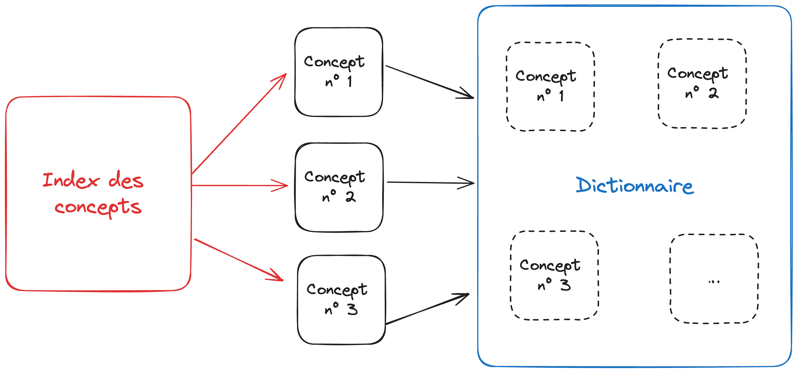
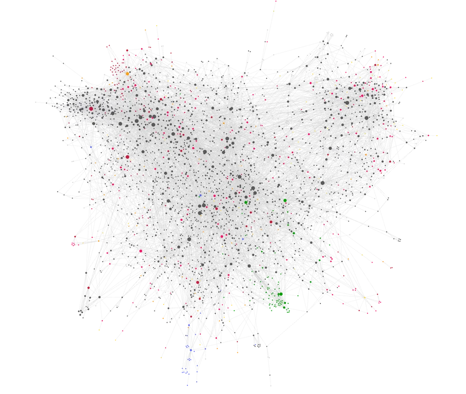
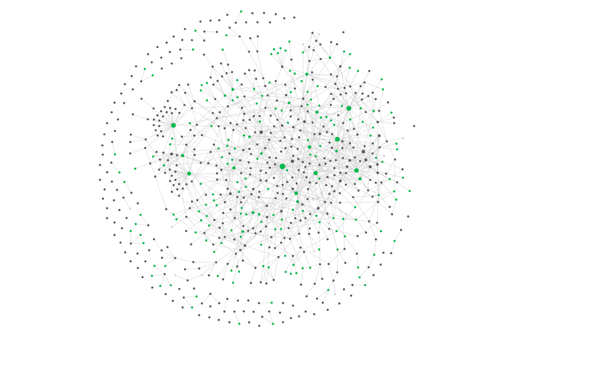
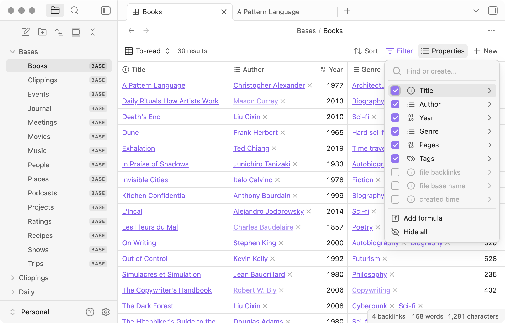
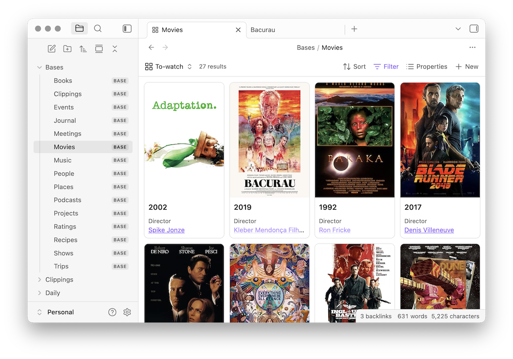
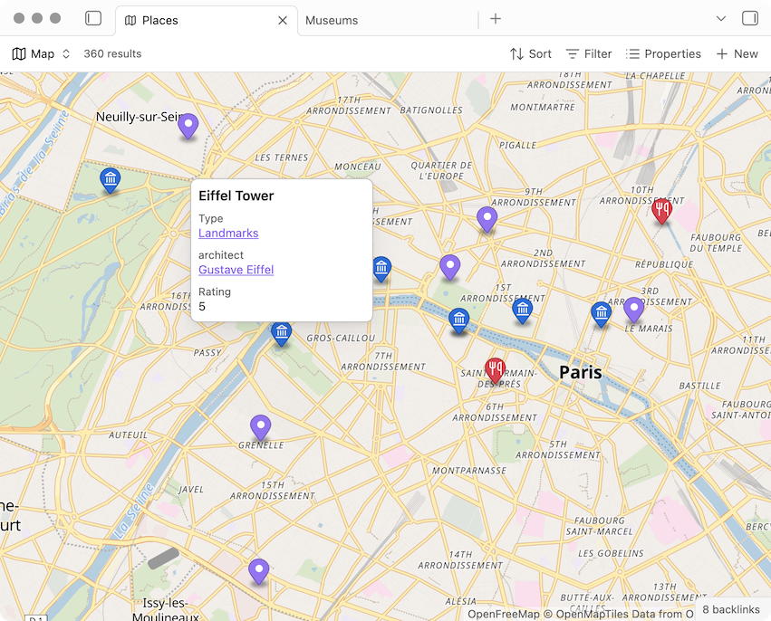

class: clear 

## Retrouvez les supports de cours sur 
<br />
<br />
.center.font150[https://enro.github.io/pratiques-collaboratives-partage-connaissances/]


---
class: clear

## Petit échauffement
<br />
<br />
Votre collègue Martin Edouard vous propose une réunion mardi à 9h, pour parler de ses problèmes de veille informationnelle. Malheureusement vous êtes pris.e sur ce créneau car vous animez une formation Basecamp en interne.
<br />
<br />
<br />
.center.font150[Que lui répondez-vous ? Préparez votre réponse en quelques lignes, sans échanger avec vos voisins et voisines.]

???

Interroger quelques étudiants au hasard du trombinoscope.

Puis demander quels étudiants mentionnent la raison de leur indisponibilité, voire proposent à Martin de se joindre à la formation.

---
class: inverse, mline, center, middle

# Pourquoi gérer ses connaissances individuelles ?

---
class: clear

## Pourquoi gérer ses connaissances individuelles ?
<br />
<br />
* À défaut de disposer d'un outil collaboratif de partage de connaissances (ex. Basecamp)

--
* Pour aller plus loin que le papier (*un cahier ne permet pas de gérer ses connaissances*)

--
* Pour savoir toujours où ajouter une nouvelle information

--
* Pour engranger et faire évoluer ses connaissances tout au long de sa vie

--
* Vous êtes des travailleurs de la connaissance (*knowledge workers*) !

???

Pourquoi pas un cahier ? Il permet simplement une prise de notes linéaire.

---
class: clear

## Définition
<br />
<br />
.center.font150[La gestion des connaissances individuelles, ou *personal knowledge management*, est le processus de collecte de l'information utile à une personne qui permet de gérer, comprendre et appliquer efficacement ces connaissances.]

???

Gérer ses idées, ses notes de réunions, ses travaux, ce qu'on lit, ce qu'on trouve inspirant...

---
class: inverse, mline, center, middle

# Comment gérer ses connaissances individuelles ?

---
class: clear

## Quels logiciels utilisez-vous pour prendre des notes, organiser vos connaissances… ?

```{r xaringan-editable, echo=FALSE}
xaringanExtra::use_editable(expires = 1)
```

<br />
<br />
* .can-edit[      ]
* .can-edit[      ]
* .can-edit[      ]
* .can-edit[      ]
* .can-edit[      ]
* .can-edit[      ]

???

MS OneNote, Google Docs, Notepad, Evernote...

Quels avantages et inconvénients ?

---
class: clear

## Avec vos outils actuels de prises de note, pouvez-vous…

<br />
<br />
* retrouver facilement les notes qui portent sur un thème donné ? .can-edit[      ]
* respecter un gabarit prédéfini ? .can-edit[      ]
* mettre en forme le texte (gras, italique…) ? .can-edit[      ]
* créer un logigramme, un tableau, une formule mathématique… ? .can-edit[      ]
* identifier des liens entre les notes ? .can-edit[      ]

---
class: clear

## L'outil idéal
Des notes :
- granulaires (méthode Zettelkasten)
- reliées et formant un graphe (= réseau)
- possédant des métadonnées
- requêtables
<br />

--

Des métadonnées :
- personnalisables 
- cherchables 
- requêtables
<br />

--

Des informations :
- requêtables
- actionables (ex. tâche)

???

Le principe de base du Zettelkasten est de prendre des notes sur des fiches individuelles, chaque fiche étant consacrée à une seule idée, concept ou information. Chaque fiche est ensuite étiquetée avec des mots-clés, ce qui permet de la retrouver facilement par la suite.

Des notions que vous avez déjà manipulées avec Cosma et Zettlr.

---
class: clear

## Exemple d'un dictionnaire

Une note par concept (avec une définition, des illustrations, exemples…), un index des pages de définitions et une page dictionnaire avec toutes les définitions.



???

Source du schéma : https://excalidraw.com/#json=EVlAduhXiqkn0SdHnhpMe,cqDNZ-38-vv5uDiRUiXwyg

---
class: clear

## Exercice


#### 1. Combien ai-je de notes au total ?

--
#### 2. Comment faire ça ?

--
#### 3. Intuitivement, à quoi ressemblerait le graphe de ces notes ?

???

1. 5

2. L'index fait *une requête* (cf. diapo sur l'outil idéal) *sur les métadonnées* (idem) des notes, et le dictionnaire embarque les notes

3. L'index et le dictionnaire sont deux noeuds qui renvoient chacun vers les trois notes, et qui ne sont pas liés entre eux. Faire un schéma au tableau.


---
class: clear

## Obsidian
<br />
<br />
Créée en 2020, **Obsidian** est un logiciel de gestion des connaissances individuelles *propriétaire* basé sur des *fichiers Markdown* (donc réversible).

Obsidian est disponible pour Mac, Windows, Linux, iOS et Android.

Obsidian est utilisé par une communauté très active qui développe de nombreux thèmes et extensions. Et revendique 1M d'utilisateurs ([source](https://www.fastcompany.com/90960653/why-people-are-obsessed-with-obsidian-the-indie-darling-of-notetaking-apps)) !

Vous pouvez retrouver Obsidian, Zettlr, Notion… dans ce tableau : https://github.com/oledeuff/BUT-Infonum-3/blob/main/Markdown/Tableau%20des%20outils%20pour%20markdown.md

??? 

Basecamp : 2004

---
class: clear

## Utiliser Obsidian en tant qu'étudiant.e

Graphe d'une année d'étude de Master soit 3 000 notes Obsidian :


???

Source : https://preview.redd.it/chwzep72n9ib1.png?width=960&crop=smart&auto=webp&s=ba09a5fe63af011c9cd9dd19527d5e83a48e734c 
---
class: clear

## Utiliser Obsidian en tant que professionnel.le

Graphe de 6 mois de travail soit 530 notes Obsidian :
<br />
<br />

???

40 minutes sont écoulées

---
class: clear

## On s'y met ? À la découverte d'Obsidian !

1. Télécharger et installer Obsidian : https://obsidian.md/download

--
2. Lancer Obsidian et créer un nouveau coffre dans un dossier de votre ordinateur

--
3. Si nécessaire, régler l'interface en français dans `r icons::fontawesome("cog")` `Settings` > `General` > `Language` 

--
4. Créer trois dossiers dans Obsidian :
* Images
* Modèles
* Notes

--

5. Créer deux notes dans le dossier Notes :
* Basecamp
* Obsidian

--

6. Compléter ces notes en rédigeant quelques lignes en .inverse[syntaxe markdown] sur chacun de ces logiciels – voir le tuto préparé par Olivier Le Deuff : https://github.com/oledeuff/BUT-Infonum-3/blob/main/Markdown/Tutoriel%20Markdown.md

--
7. Ajouter un tag sur ces deux notes en cliquant sur `r icons::fontawesome("ellipsis-h")` `Ajouter des propriétés de fichier`. 

???

L'objectif d'un langage de balisage léger est de faciliter la création de documents lisibles par les humains et également analysables par les machines ; il est utilisé pour les cas où un langage de balisage complet comme le XML ou HTML serait trop complexe.

Exemples de tags : "logiciel", "outil"

---
class: clear

## Aller plus loin avec les modèles (*templates*)

1. Aller dans `r icons::fontawesome("cog")` `Paramètres` > `Modules principaux` > vérifier que le module `Modèles` `r icons::fontawesome("toggle-on")` est activé > cliquer sur `r icons::fontawesome("cog")` pour accéder aux options > définir l'emplacement du dossier modèles comme `Modèles`.

--
2. Télécharger ces trois modèles à placer dans le dossier `Modèles` : [https&#58;//github.com/Enro/pratiques-collaboratives-partage-connaissances/tree/main/Coffre Obsidian/Modèles](https://github.com/Enro/pratiques-collaboratives-partage-connaissances/tree/main/Coffre%20Obsidian/Modèles)
  * Cours
  * Devoir
  * UE

--
3. Tester un modèle : créer une note et cliquer sur l'icône `r icons::fontawesome("copy")` `Insérer le modèle` puis choisir le modèle à appliquer

--
3. Télécharger les notes que j'ai créées à partir de ces modèles, à placer dans le dossier `Notes` : [https&#58;//github.com/Enro/pratiques-collaboratives-partage-connaissances/tree/main/Coffre Obsidian/Notes](https://github.com/Enro/pratiques-collaboratives-partage-connaissances/tree/main/Coffre%20Obsidian/Notes)

--
4. Ajouter des rétroliens vers les notes Basecamp et Obsidian à chaque fois que ces outils sont mentionnés, en utilisant la syntaxe `[[Nom de la note]]`.

--
5. Afficher le graphe de vos notes en cliquant sur le bouton `r icons::fontawesome("code-branch")` `Ouvrir la vue graphique`.

---
class: clear

## Aller plus loin avec Bases

Bases est un plugin pour Obsidian qui permet d'afficher les informations contenues dans ses notes grâce à des requêtes -- et plus largement de gérer ses notes comme une base de données.

.pull-left[
**Table**

]

.pull-right[
**Cartes**

]

<!--  -->


???

2 affichages possibles <!-- Les affichages List et Map sont en early access uniquement --> 


---
class: clear 

## On s'y met ? À la découverte de Bases !

### Tutoriel Bases

https://enro.github.io/pratiques-collaboratives-partage-connaissances/Tutoriel-Bases.html

--

<!-- à reprendre ici -->

### Exercices Bases

```{css, echo=FALSE}
#embeded_pdf {
 width: 100%; 
 height: 70%;
}

```

<embed src="https://enro.github.io/pratiques-collaboratives-partage-connaissances/Coffre%20Obsidian/Exercices%20Bases.pdf" type="application/pdf" id="embeded_pdf">

???

Exercices corrigés : ouvrir /Users/antoine/Documents/Enseignement/BUT Infonum/Cours "Pratiques collaboratives et partage de connaissances"/Coffre Obsidian/Exercices corrigés Bases.md dans Obsidian

Exercices PDF : https://enro.github.io/pratiques-collaboratives-partage-connaissances/Coffre%20Obsidian/Exercices%20Bases.pdf

---
class: clear

## Bilan tête - main - cœur
<br />
<br />
Qu'avez-vous appris ?
<br />
<br />
<br />
Qu'avez-vous fait ?
<br />
<br />
<br />
Qu'avez-vous aimé ?