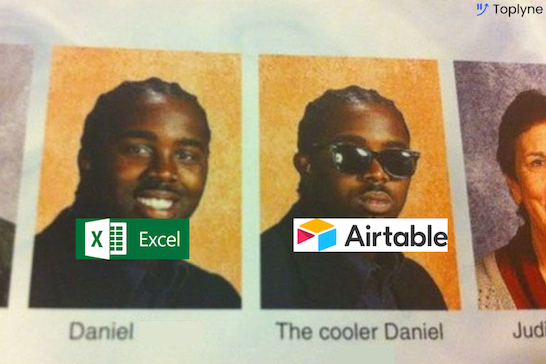
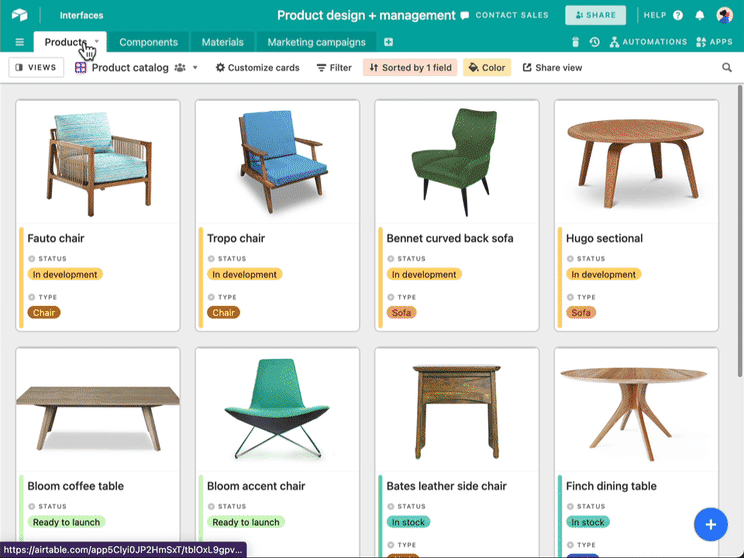
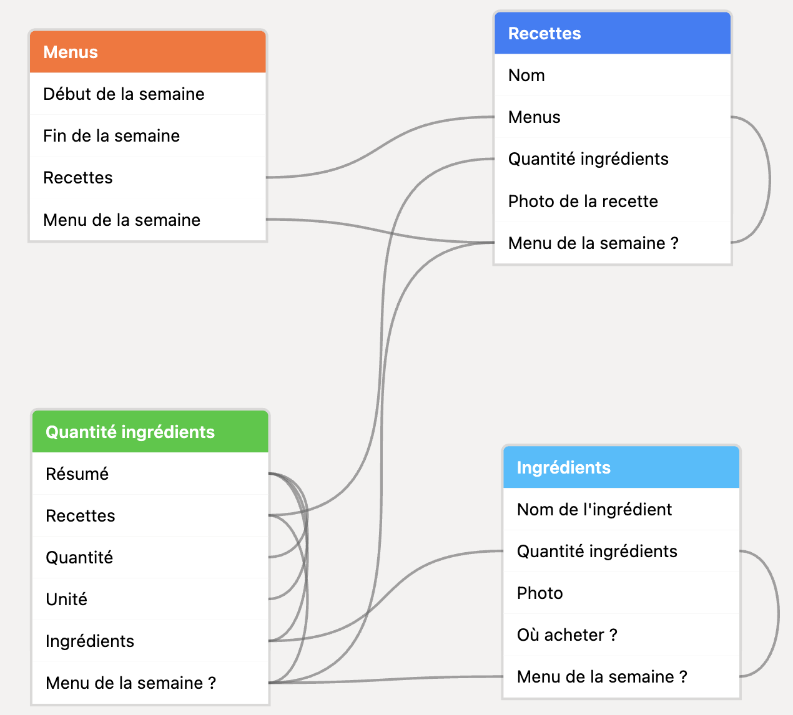
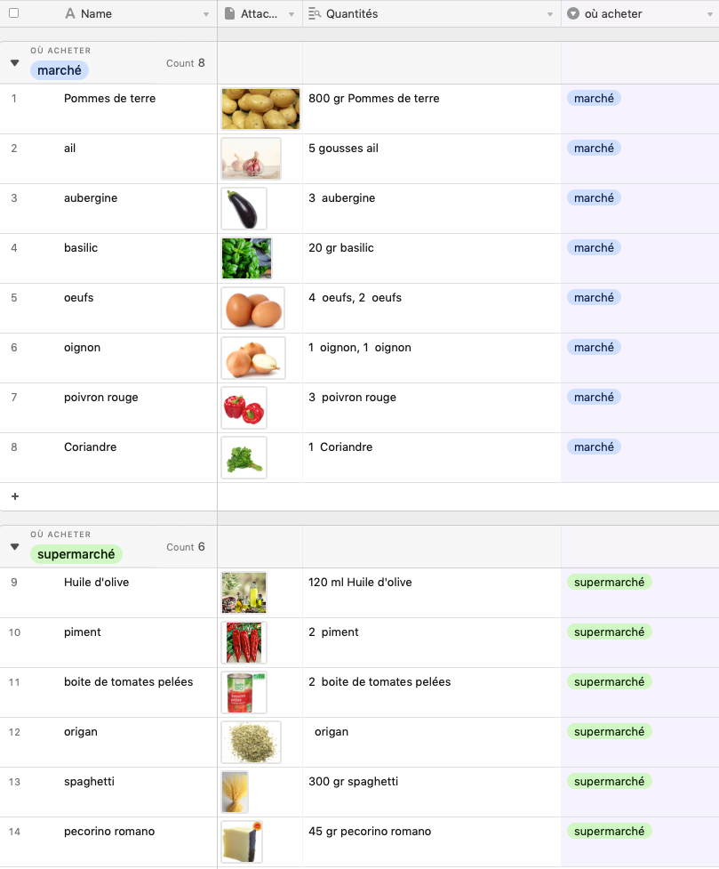
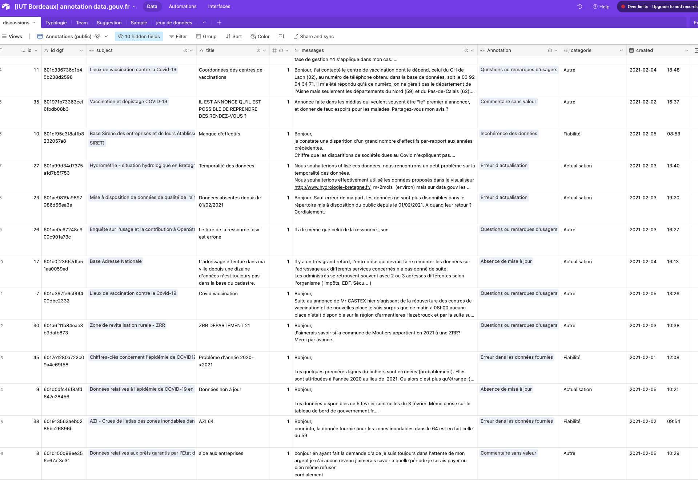
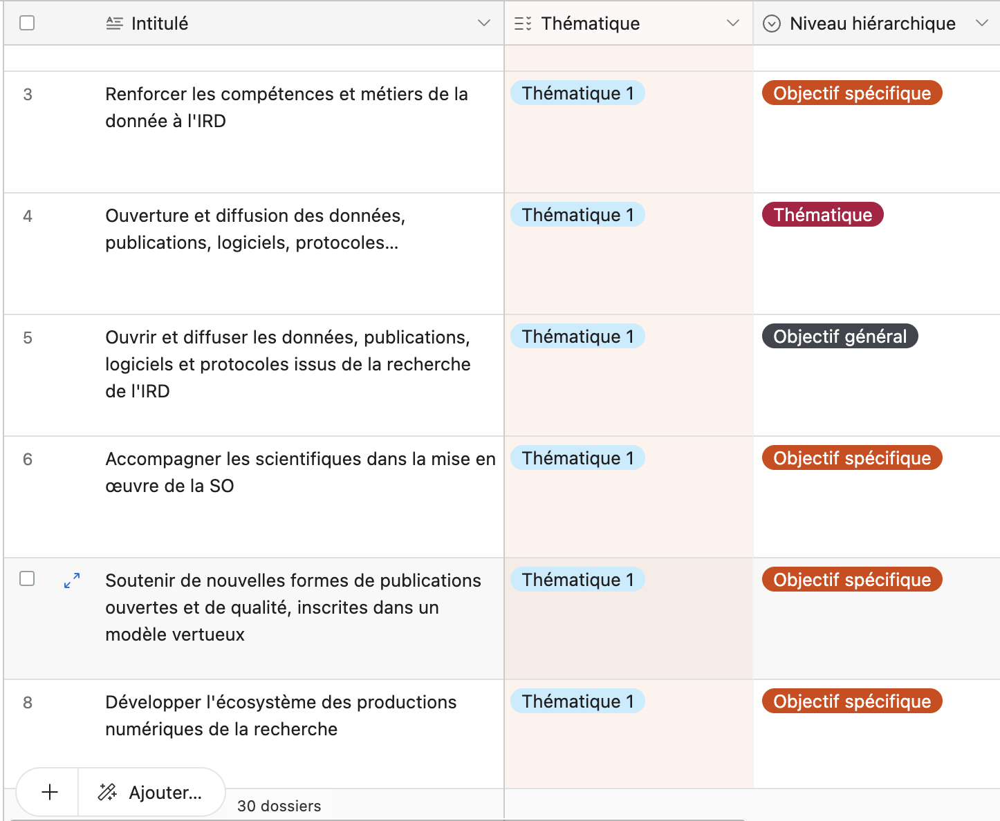
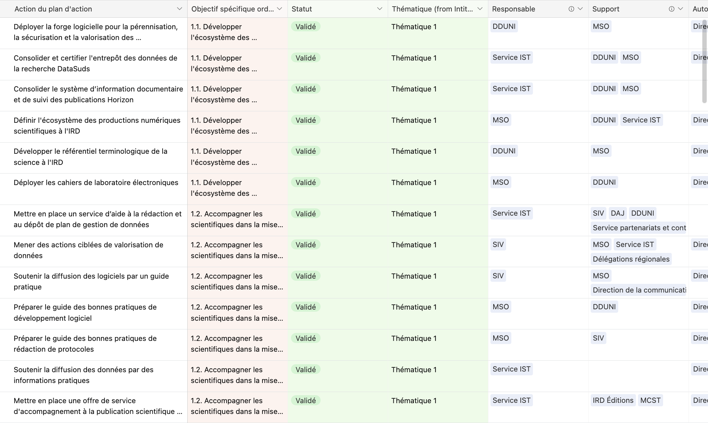

class: inverse, mline, center, middle

# Introduction aux données structurées
---
class: clear

## Obsidian (avec Bases) et Notion / Anytype permettent de manipuler des données structurées
 

* une note = un objet
* une propriété = un attribut = une métadonnée

tout en conservant des fonctionnalités de traitement de texte.

C'est un bon compromis !

---
class: clear

## D'autres outils sont dédiés à la gestion des données tabulaires
 

--

* Excel, Google Spreadsheet et autres tableurs
* les systèmes de gestion de bases de données relationnelles (SGBD) : SQL, Access…
* Airtable, Grist… à mi-chemin entre le tableur et les bases de données
 
 

Ils sont beaucoup plus puissants et performants sur les données tabulaires !

???

Qu'est-ce que vous connaissez ?

---
class: clear

## Quand utiliser Airtable ?

> "Les tableurs sont vraiment optimisés pour l'analyse numérique et les calculs financiers. Cependant, près de 90 % des tableurs n'ont pas de formules. La plupart sont utilisés à des fins d'organisation."

<blockquote>"Si vous utilisez un tableur pour autre chose que des calculs numériques, ce tableur devrait être un Airtable" - le fondateur d'Airtable</blockquote>

.center[]

---
class: clear

## Airtable est un outil puissant
 
 
* outil payant dans le cloud (SaaS)
* pas d'accès aux fichiers source
* collaboratif
* des modèles (*templates*) pour se faciliter la vie
* convient à de très nombreux usages
* 750 millions d'utilisateurs actifs en 2021 ([source](https://www.toplyne.io/blog/heir-to-the-tables-the-airtable-story))

???

Contre 100 M d'utilisateurs pour Notion et 1M pour Obsidian.

---
class: clear

## On s'y met ? À la découverte d'Airtable !
 
 

Se connecter sur https://s.42l.fr/airtable_2025

???

Utilisation du forfait gratuit (compte créé avec l'adresse email IUT Bordeaux Montaigne). Les étudiants sont invités par le lien de recommandation https://airtable.com/invite/r/dti4Q4yj mais pas sur l'espace de travail collaboratif.

---
class: clear

## Quelques notion de vocabulaire 
 
 
L'**espace de travail** regroupe des bases qui ont une cohérence entre elles (même sujet, même collaborateurs, même formule d'abonnement…).

Une **base** est un ensemble cohérent de tables dont vous allez définir la structure et le contenu. 

Une **table** contient des enregistrements décrits par un ensemble de champs.

Une **vue** est une table virtuelle qui affiche le contenu de vos tables en fonction de votre requête.

---
class: clear

## On peut créer une base…
 
 
* à partir de modèles 
* en suivant un guide pas à pas
* en chargeant un fichier Excel
* en démarrant de zéro

---
class: clear

## Exemple de base

.center[]

---
class: clear

## Exercice : votre première base

Exercice emprunté à Samuel Goëta (Datactivist / Sciences Po Aix).

#### 1. Retournez à l'accueil https://airtable.com et cliquez sur `r icons::fontawesome("plus")` `Créer` > `Créer votre propre app` puis donnez à votre base "Untitled Base" le nom "Recettes MonPrénom"

Cette base va vous permettre d'organiser vos menus de la semaine et vos courses. Quelle devra être la structure de la base ?

???

Quelles informations, structurées et reliées comment ?

---
class: clear

## Votre première table

Une table (ou *tableau*) contient une liste d’objets homogènes. Il faut créer une table pour chaque objet que vous avez besoin d’organiser.

#### 2. Renommez la première table "Table 1" en "Menus"

Supprimez les colonnes existantes sauf la 1e colonne.

Cette table contiendra des menus pour une semaine.

#### 3. Configurez la table "Menus" avec les champs suivants (attention aux types de champs) : 
* "Début de la semaine" de type `Date` : ce sera votre premier champ, à la place du champ "Name" (c'est un *champ principal* c'est-à-dire qu'il désigne chaque entrée du tableau)
* "Fin de la semaine" de type `Date`
* "Recettes" de type `Lier à une autre entrée` > `Créer un tableau`
* "Menu de la semaine" de type `Case à cocher`

La force d'Airtable réside dans le choix du type qui va permettre à Airtable de traiter correctement l'information qu'il contient. Heureusement, le type peut être modifié à tout moment.

???

Demander aux étudiants d'expliquer dans un langage simple ce qu'ils ont fait et compris.

---
class: clear

## Autres tables reliées à la première table

La table "Recettes" vient d'être créée. Elle se nomme pour l'instant "Nouveau tableau" : renommez-la.

#### 4. Configurez la table "Recettes" avec les champs suivants : 
* "Nom" 
* "Menus" (déjà créée)
* "Quantité ingrédients" de type `Lier à une autre entrée` > `Créer un tableau`
* "Photo de la recette" de type `Pièce jointe`
* "Menu de la semaine ?" de type `Recherche` : choisir la source "Menus" et le champ "Menu de la semaine"

???

Si le type Recherche ne fonctionne pas, créer le champ à la fin des étapes, ou bien le créer après avoir créé un champ de type "Lier à une autre entrée"

---
class: clear

La table "Quantité ingrédients" vient d'être créée. Elle se nomme pour l'instant "Nouveau tableau" : renommez-la.

#### 5. Configurez la table "Quantité ingrédients" avec les champs suivants :
* "Résumé" de type `Numéro automatique` (pour l'instant)
* "Recettes" (déjà créé)
* "Quantité" de type `Numéro`
* "Unité" de type `Sélection unique` (vous entrerez les options ensuite)
* "Ingrédients" de type `Lier à une autre entrée` > `Créer un tableau`
* "Menu de la semaine ?" de type `Recherche` : choisir la source "Recettes" et le champ "Menu de la semaine ?"

#### 6. Configurez le champ "Résumé" pour afficher la quantité de chaque ingrédient (par exemple : "80 gr. potiron") : il va falloir appeler et combiner différents champs
* changez le type du champ "Résumé" en `Formule`
* dans la formule, insérez le champ "Quantité"
* ajoutez un espace en ajoutant `& " " &` dans la formule
* ajoutez le champ "Unité"
* ajoutez un espace avec le prochain champ en ajoutant `& " " &` dans la formule
* ajoutez le champ "Ingrédients"

???

{Quantité}& " " &{Unité}& " " &{Ingrédients}

---
class: clear

La table "Ingrédients" vient d'être créée. Elle se nomme pour l'instant "Nouveau tableau" : renommez-la.

#### 7. Configurez la table "Ingrédients" avec les champs suivants : 
* "Nom de l'ingrédient" de type `Texte sur une seule ligne`
* "Quantité ingrédients" (déjà créé)
* "Photo" de type `Pièce jointe`
* "Où acheter ?" de type `Sélection unique` avec deux options : "marché" et "supermarché"
* "Menu de la semaine ?" de type `Recherche` : choisir la table "Quantité ingrédients" et le champ "Menu de la semaine ?"

???

---
class: clear

## Schéma des données

.center[]

---
class: clear

#### 8. Remplissez les différentes tables en commençant par "Recettes". Pour chaque recette vous devrez compléter les tables "Ingrédients" et "Quantité ingrédients". Puis vous pourrez composer des "Menus".

Les données de chaque table doivent être **structurées**. Contrairement à une feuille de calcul Excel, on ne peut pas ajouter ce qu'on veut dans une cellule. Les cellules ne peuvent contenir que des informations du type défini en colonne.

Ce qui signifie :
* pas de mise en forme fantaisiste
* pas de somme au milieu de nulle part
* …

---
class: clear

#### 9. Dans la table `Ingrédients` et dans la barre latérale `Vues`, créez une vue `Tableur` intitulée "Les ingrédients de la semaine" en n'affichant que les champs suivants (fonction `r icons::fontawesome("eye-slash")` `Masquer le champ`), en filtrant uniquement les recettes de la semaine et en groupant par "Où acheter ?"
 

.center[]

???

Comment iriez-vous faire les courses ?

---
class: clear

## Base Airtable de la promo 20/21 de la LP Médiations de l’information numérique et des données

[.center[]](https://airtable.com/appeyi0431fV4OJn4/shrbxFxbTf88iHqCR)

Jeu de données publié sur data.gouv.fr et qui a eu les honneurs de leur comm' : https://www.data.gouv.fr/fr/posts/que-se-dit-il-dans-les-commentaires-sur-data-gouv-fr/

???

Source : https://airtable.com/appeyi0431fV4OJn4/shrbxFxbTf88iHqCR

---
class: clear

## Activité : les insolites de data.gouv.fr

Vous devez écumer le site data.gouv.fr pour identifier des informations insolites à partir de jeux de données en open data.

Voici les informations qui m'intéressent :
* Fait insolite
* URL du jeu de données
* Mots-clés

Créez une seule base Airtable et renseignez la de façon collaborative.

--

Par exemple :
* il y a eu 29 278 771€ de dépenses en « produits contre la dysfonction érectile » en Île-de-France en 2013
* il existe une seule femme chirurgien urologue de moins de 30 ans
* il y a plus d’agents cynophiles (309) que de chiens (278) dans la police municipale en France
* le prénom Marie-Christophe est porté par deux femmes conseillères municipales.

???

Optionnel, uniquement s'il reste beaucoup de temps.

Attention, avec ce mode opératoire il n'est pas possible de faire travailler les étudiants sur la même base car ils ont chacun leur espace de travail. Par contre ils ont accès aux bases "partagées avec vous" dont celles que j'ai créé.

Cf. https://airtable.com/appB1cL7jM2YmlRcc/shrdAS7GZV8bYib12/tblERR1IoRz4ica5L et https://www.reddit.com/r/france/comments/5ing61/datagouv_ou_comment_perdre_des_heures_%C3%A0_se/

---
class: clear

## Bilan tête - main - cœur
 
 
Qu'avez-vous appris ?
 
 
 
Qu'avez-vous fait ?
 
 
 
Qu'avez-vous aimé ?

---
class: clear

## Devoir sur table 

Sans ordinateur et sans support, répondez au quiz en 15 minutes. En silence et sans regarder le travail du voisin.

---
class: clear

## Corrigé

---
class: clear 

## Airtable permet d'organiser des données textuelles
 
 
Imaginez que vous devez rédiger un texte fortement structuré et hiérarchisé. Le faire sous Airtable permet :
* d'organiser et réorganiser la structure du texte
* de garder la trace de chaque version de chaque paragraphe
* de capitaliser sur ce travail sans limitation.
 

Exemple : rédaction d'un document stratégique de type feuille de route, suivie de la rédaction du plan d'action opérationnel.

---
class: clear

## Activité : feuille de route science ouverte de l'IRD

#### 1. Retournez à l'accueil https://airtable.com et cliquez sur `r icons::fontawesome("plus")` `Créer` > `Créer votre propre app` puis donnez à votre base le nom `IRD MonPrénom`

#### 2. Renommez la première table en "Feuille de route"

Supprimez les colonnes existantes.

#### 3. Copiez sous forme tabulaire la feuille de route science ouverte de l'IRD

La feuille de route est disponible sur https://s.42l.fr/fdr_ird

Vous devrez créer les bons champs pour stocker et organiser toute l'information de la feuille de route (à partir de la page 3).

???

Réfléchissez à la structure de la feuille 

---
class: clear

## Corrigé

.center[]

???

Table de 31 lignes (hors préambule)

https://airtable.com/appxyZfJw3qzR7qVn/shrK75V6yGjtPD33t

Ne pas parler du Statut à ce stade, le garder pour la suite (le formulaire).

---
class: clear

## Création de vues
 

#### 4. Dans le menu `Vues`, créez une vue tableur pour n'afficher que les objectifs de la thématique 1
 
 

#### 5. Créez une autre vue pour n'afficher que les objectifs de la thématique 2

???

Comment s'y prendrait-on pour afficher les items dans l'ordre du PDF, si je les avais renseignés dans le désordre ? Ajouter une colonne rang, comme dans mon expérience d'avoir construit cette table chez Datactivist.

---
class: clear

## Formulaire pour collecter de nouvelles propositions d'objectifs
 

#### 6. Dans le menu `Vues`, créez un formulaire et paramétrez-le

???

Corrigé : https://airtable.com/appxyZfJw3qzR7qVn/shrTmg1O7VB7PyMvo

Idée : ajouter un champ "Statut" pour savoir quels objectifs doivent être revus.

---
class: clear

## Plan d'action science ouverte de l'IRD
 

#### 7. Créez une nouvelle table "Plan d'action"
 

#### 8. Copiez sous forme tabulaire le plan d'action science ouverte de l'IRD

Le plan d'action est disponible sur https://s.42l.fr/pa_ird

N'hésitez pas à utiliser des champs liés à la première table.

---
class: clear

## Corrigé
 

.center[]

???

https://airtable.com/appxyZfJw3qzR7qVn/shrK75V6yGjtPD33t

---
class: clear

## Bilan tête - main - cœur
 
 
Qu'avez-vous appris ?
 
 
 
Qu'avez-vous fait ?
 
 
 
Qu'avez-vous aimé ?